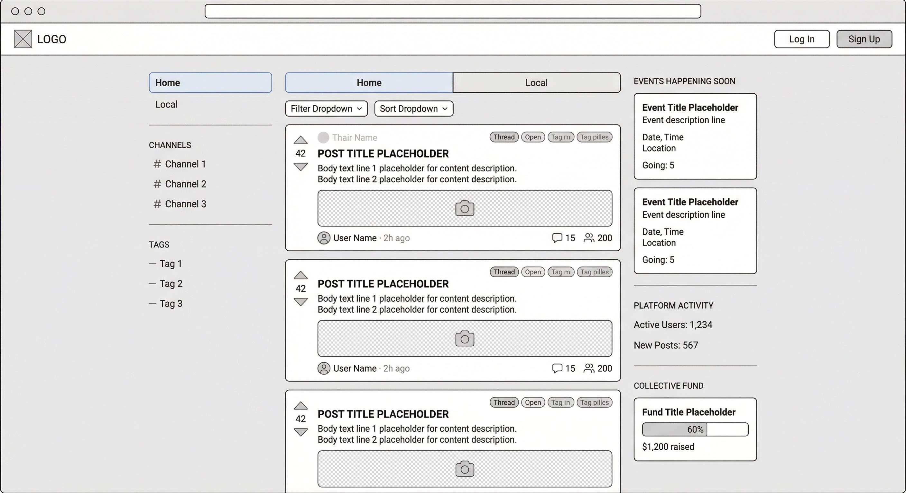

# Wireframe: Front Page — Logged Out

The landing page for unauthenticated users. Displays public feeds, events, and community activity.



## Top Bar

```
+---------------+-----------------------+--------------------------------+
| Logo (flex 1) | [empty]      (flex 3) | [Log In] [Sign Up]    (flex 1) |
+---------------+-----------------------+--------------------------------+
```

- **Page Actions**: Empty — no search bar for logged-out users.
- **Global Actions**: Log In and Sign Up buttons.

---

## Content Area

```
+---------------+----------------+---------------------+
| Menu (flex 1) | Feeds (flex 3) | Activities (flex 1) |
+---------------+----------------+---------------------+
```

Three-column layout within the content wrapper.

---

### Menu (Left Sidebar)

```
+---------------------+
| Home Menu Item      |
| Local Menu Item     |
+---------------------+
| Channels Header     |
+---------------------+
| Channels            |
+---------------------+
| Tags Header         |
+---------------------+
| Tags                |
+---------------------+
```

| Element          | Type      | Notes                                      |
| ---------------- | --------- | ------------------------------------------ |
| Home Menu Item   | Nav Link  | Active by default, shows the Home feed     |
| Local Menu Item  | Nav Link  | Switches to the Local feed                 |
| Channels Header  | Header    | Section label for channel list              |
| Channels         | List      | Scrollable list of public channels          |
| Tags Header      | Header    | Section label for tag list                  |
| Tags             | List      | Scrollable list of popular/active tags      |

**Not shown when logged out**: "My Feed" menu item, "New Channel" button.

---

### Feeds (Center Column)

```
+------------------------------------------+
| Feeds Tabs (flex 3) | [empty]   (flex 1) |
+------------------------------------------+
| Filters (flex 3)    | Feed Count (flex 1)|
+------------------------------------------+
| Feed                                     |
+------------------------------------------+
```

#### Feed Tabs

```
+----------------+-----------------+
| Home Feed Item | Local Feed Item |
+----------------+-----------------+
```

Only Home and Local tabs are visible. "My Feed" is hidden for logged-out users.

#### Filters

```
+------------------+----------------+
| Filter Drop Down | Sort Drop Down |
+------------------+----------------+
```

| Element          | Type     | Notes                                              |
| ---------------- | -------- | -------------------------------------------------- |
| Filter Drop Down | Dropdown | Filter posts by type (Thread, Project, All)        |
| Sort Drop Down   | Dropdown | Sort by (Newest, Most Votes, Most Active, etc.)    |

#### Feed Count

Displays the total number of posts matching the current filter, right-aligned.

#### Feed Posts

A vertical list of post cards. Each card follows the **Feed Post** component spec (see [06-components.md](06-components.md#feed-post)).

**Not shown when logged out**: Add Thread / Add Project action buttons.

---

### Activities (Right Sidebar)

```
+------------------------------+
| Events Happening Soon Header |
| Events Happening Soon        |
+------------------------------+
| Platform Activity Header     |
| Platform Activities          |
+------------------------------+
| Collective Fund Header       |
| Collective Funds             |
+------------------------------+
```

| Section                 | Content                                               |
| ----------------------- | ----------------------------------------------------- |
| Events Happening Soon   | List of upcoming Event cards (see [components](06-components.md#event)) |
| Platform Activity       | Key stats — active users, new posts, etc.             |
| Collective Fund         | Active fundraising campaigns with progress bars       |

**Not shown when logged out**: "My Events" section, RSVP controls, Contribute buttons.
