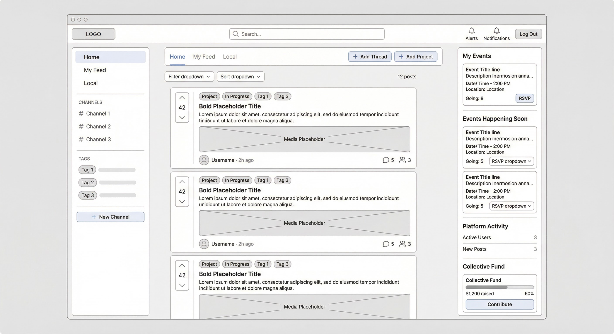

# Wireframe: Front Page — Logged In

The main dashboard for authenticated users. Adds personal feeds, actions, and interactive elements.



## Top Bar

```
+---------------+-----------------------+----------------------------------------------+
| Logo (flex 1) | [Search Bar] (flex 3) | [Alerts] [Notifications] [Log Out]  (flex 1) |
+---------------+-----------------------+----------------------------------------------+
```

- **Page Actions**: Search bar with text input and search icon.
- **Global Actions**: Alerts icon button, Notifications icon button, Log Out button.

---

## Content Area

```
+---------------+----------------+---------------------+
| Menu (flex 1) | Feeds (flex 3) | Activities (flex 1) |
+---------------+----------------+---------------------+
```

---

### Menu (Left Sidebar)

```
+---------------------+
| Home Menu Item      |
| My Feed Menu Item   |  <-- logged-in only
| Local Menu Item     |
+---------------------+
| Channels Header     |
+---------------------+
| Channels            |
+---------------------+
| Tags Header         |
+---------------------+
| Tags                |
+---------------------+
| New Channel Button  |  <-- logged-in only
+---------------------+
```

| Element             | Type      | Notes                                         |
| ------------------- | --------- | --------------------------------------------- |
| Home Menu Item      | Nav Link  | Shows the Home feed (all public posts)        |
| My Feed Menu Item   | Nav Link  | Posts from channels/users you follow           |
| Local Menu Item     | Nav Link  | Posts from your local community                |
| Channels            | List      | Public + subscribed channels                   |
| Tags                | List      | Popular and followed tags                      |
| New Channel Button  | Button    | Opens the create-channel flow                  |

---

### Feeds (Center Column)

```
+---------------------------------------------+-----------------------------------+
| Feeds Tabs (flex 3)                         | Actions (flex 1)                  |
+---------------------------------------------+-----------------------------------+
| Filters (flex 3)                            | Feed Count (flex 1)               |
+---------------------------------------------+-----------------------------------+
| Feed                                                                            |
+---------------------------------------------+-----------------------------------+
```

#### Feed Tabs

```
+----------------+--------------+-----------------+
| Home Feed Item | My Feed Item | Local Feed Item |
+----------------+--------------+-----------------+
```

All three tabs visible for logged-in users.

#### Actions

```
+-------------------+--------------------+
| Add Thread Button | Add Project Button |
+-------------------+--------------------+
```

| Element             | Type   | Notes                                 |
| ------------------- | ------ | ------------------------------------- |
| Add Thread Button   | Button | Opens the new thread composer          |
| Add Project Button  | Button | Opens the new project composer         |

#### Filters

```
+------------------+----------------+
| Filter Drop Down | Sort Drop Down |
+------------------+----------------+
```

Same as logged-out, but filter options may include additional types.

#### Feed

Vertical list of **Feed Post** cards (see [06-components.md](06-components.md#feed-post)).

---

### Activities (Right Sidebar)

```
+------------------------------+
| My Events Header             |  <-- logged-in only
| My Events                    |  <-- logged-in only
+------------------------------+
| Events Happening Soon Header |
| Events Happening Soon        |
+------------------------------+
| Platform Activity Header     |
| Platform Activities          |
+------------------------------+
| Collective Fund Header       |
| Collective Funds             |
+------------------------------+
```

#### My Events

Events the user has RSVP'd to or created. Each event card includes an RSVP status indicator.

#### Events Happening Soon

Upcoming community events. Each card includes an **RSVP dropdown** (Going / Maybe / Not Going).

#### Platform Activity

```
+-------+---------+------+
| Title | Spacing | Count|
+-------+---------+------+
```

Key platform stats displayed as label-value pairs (e.g., Active Users: 1,234).

#### Collective Fund

```
+--------+
| Header |
| Pitch  |
| Funds  |
+--------+
```

Each fund shows a progress bar, amount raised, and a **Contribute** button (logged-in only).

See [06-components.md](06-components.md#fund) for Fund component details.
