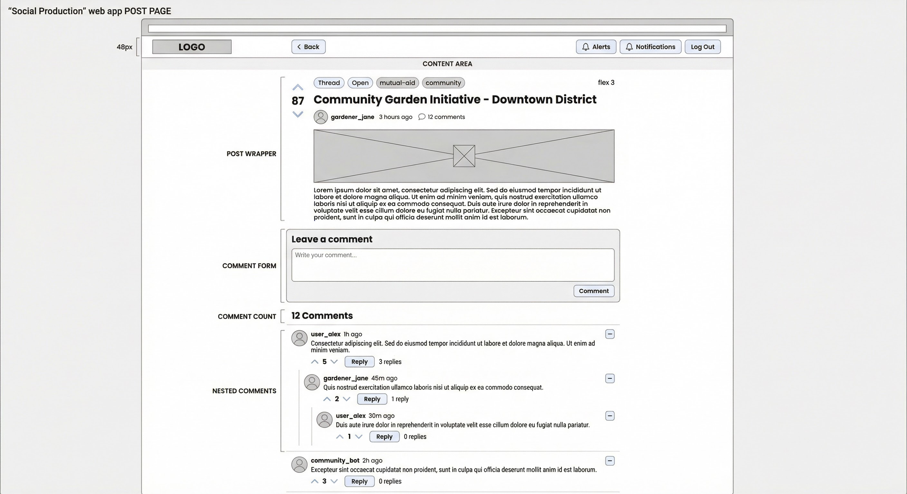

# Wireframe: Post Page — Thread View

A full-page view for a Thread-type post with comments and discussion.



## Top Bar

```
+---------------+-----------------------+----------------------------------------------+
| Logo (flex 1) | [< Back]     (flex 3) | [Alerts] [Notifications] [Log Out]  (flex 1) |
+---------------+-----------------------+----------------------------------------------+
```

- **Page Actions**: Back button — returns to the previous page/feed.
- **Global Actions**: Standard logged-in or logged-out actions.

---

## Content Wrapper

```
+------------------+------------------+------------------+
| Padding (flex 1) | Content (flex 3) | Padding (flex 1) |
+------------------+------------------+------------------+
```

Single centered column layout. No sidebars on the post page.

---

## Content

```
+-----------------+
| Post Wrapper    |
+-----------------+
| Comment Form    |
+-----------------+
| Comment Count   |
+-----------------+
| Nested Comments |
+-----------------+
```

All sections stack vertically.

---

### Post Wrapper

```
+--------------------------------------+
| Vote Button (flex 1) | Post (flex 3) |
+--------------------------------------+
```

For Thread-type posts, only the vote button and post content are shown. No Members, Events, Post Actions, or Updates sections.

#### Vote Button

Upvote/downvote arrows with a vote count displayed between them. Vertical layout.

#### Post

```
+--------------------------------------+
| Type and Status | Tags               |
+--------------------------------------+
| Title                                |
+--------------------------------------+
| Posted By | Time Ago | Comment Count |
+--------------------------------------+
| Media                                |
| Text                                 |
+--------------------------------------+
```

| Element         | Type         | Notes                                         |
| --------------- | ------------ | --------------------------------------------- |
| Type and Status | Badge row    | e.g., "Thread" badge + "Open" status badge    |
| Tags            | Pill list    | Tag labels, clickable to filter by tag         |
| Title           | Heading      | Post title, bold and prominent                 |
| Posted By       | User link    | Avatar + username, links to user profile       |
| Time Ago        | Text         | Relative timestamp (e.g., "3 hours ago")       |
| Comment Count   | Text + Icon  | Comment icon with count                        |
| Media           | Media block  | Images, video, or other embedded media         |
| Text            | Rich text    | Full post body content                         |

---

### Comment Form

Shown only for logged-in users.

```
+-----------------+
| Leave a comment |
| Input           |
| Comment Button  |  <-- right aligned
+-----------------+
```

| Element        | Type      | Notes                                  |
| -------------- | --------- | -------------------------------------- |
| Label          | Text      | "Leave a comment"                      |
| Input          | Textarea  | Multi-line text input                  |
| Comment Button | Button    | Submits the comment, right-aligned     |

---

### Comment Count

Displays total comment count as a header (e.g., "12 Comments") with a horizontal divider below.

---

### Nested Comments

Recursive tree of comments. Each comment follows the **Nested Comment** component spec (see [06-components.md](06-components.md#nested-comment)).

```
+-----------------------------------------------------------------+
| User | Time Ago | Expand/Collapse Button                        |
+-----------------------------------------------------------------+
| Text                                                            |
+-----------------------------------------------------------------+
| Vote Count Button | Reply Button (if logged in) | Replies Count |
+-----------------------------------------------------------------+
| Nested Comments                                                 |
+-----------------------------------------------------------------+
```

Comments are visually indented to represent nesting depth. Each level adds a left margin/border to show hierarchy.
