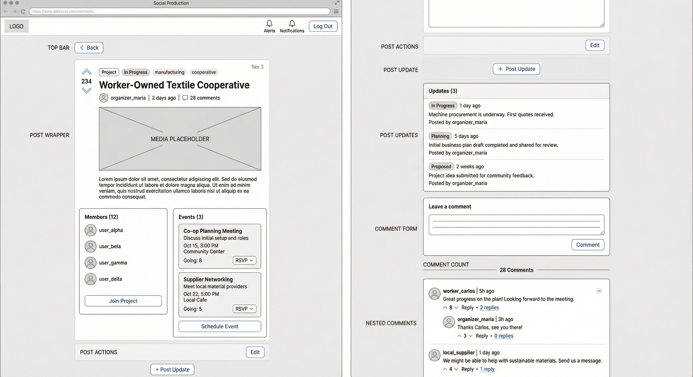

# Wireframe: Post Page — Project View

A full-page view for a Project-type post. Extends the Thread view with Members, Events, Post Actions, and Updates sections.



## Top Bar

```
+---------------+-----------------------+----------------------------------------------+
| Logo (flex 1) | [< Back]     (flex 3) | [Alerts] [Notifications] [Log Out]  (flex 1) |
+---------------+-----------------------+----------------------------------------------+
```

Same as Thread view.

---

## Content Wrapper

```
+------------------+------------------+------------------+
| Padding (flex 1) | Content (flex 3) | Padding (flex 1) |
+------------------+------------------+------------------+
```

Single centered column. No sidebars.

---

## Content

```
+-----------------+
| Post Wrapper    |
+-----------------+
| Comment Form    |
+-----------------+
| Comment Count   |
+-----------------+
| Nested Comments |
+-----------------+
```

---

### Post Wrapper

The Project post wrapper includes additional sections not present in Thread posts.

```
+--------------------------------------+
| Vote Button (flex 1) | Post (flex 3) |
+--------------------------------------+
| Members (flex 1) | Events (flex 1)   |  <-- project only
+--------------------------------------+
| Post Actions (aligned right)         |  <-- moderator only
+--------------------------------------+
| Post Update Button                   |  <-- moderator only
+--------------------------------------+
| Post Updates                         |
+--------------------------------------+
```

#### Post

Same structure as Thread post (see [04-post-page-thread.md](04-post-page-thread.md#post)), but with "Project" type badge and project-relevant status (e.g., "In Progress", "Proposed", "Completed").

---

#### Members

Visible on all Project posts.

```
+---------------------------+
| Header with Members Count |
| Members                   |
| Join Project Button       |  <-- if logged in
+---------------------------+
```

| Element              | Type      | Notes                                       |
| -------------------- | --------- | ------------------------------------------- |
| Header               | Text      | "Members (N)" with count                    |
| Members              | List      | User avatars + usernames, scrollable         |
| Join Project Button  | Button    | Allows logged-in user to join the project    |

---

#### Events

Visible on all Project posts.

```
+--------------------------+
| Header with Events Count |
| Events                   |
| Schedule Event Button    |  <-- if logged in
+--------------------------+
```

| Element               | Type      | Notes                                       |
| --------------------- | --------- | ------------------------------------------- |
| Header                | Text      | "Events (N)" with count                     |
| Events                | List      | Event cards (see [06-components.md](06-components.md#event)) |
| Schedule Event Button | Button    | Opens the event scheduler for this project   |

Each event card includes:

```
+-----------------------------------------------+
| Title                                         |
| Description                                   |
| Date and Time                                 |
| Location                                      |
+-----------------------------------------------+
| Going Count | RSVP Status (only if logged in) |
+-----------------------------------------------+
```

---

#### Post Actions

Visible only when: logged in + post is a project + user is a moderator.

```
+-------------+
| Edit Button |
+-------------+
```

Right-aligned. Opens the post editor.

---

#### Post Update Button

Visible only when: logged in + post is a project + user is a moderator.

A button to add a new status update to the project.

---

#### Post Updates

```
+---------------------------+
| Header with Updates Count |
| Updates                   |
+---------------------------+
```

A chronological list of project updates. Each update:

```
+-------------------+
| Status | Time Ago |
| Text              |
| Posted By User    |
+-------------------+
```

| Element        | Type        | Notes                                            |
| -------------- | ----------- | ------------------------------------------------ |
| Status         | Badge       | Status at time of update (e.g., "In Progress")   |
| Time Ago       | Text        | Relative timestamp                                |
| Text           | Rich text   | Update description                                |
| Posted By User | User link   | Avatar + username of update author                |

---

### Comment Form

Same as Thread view. See [04-post-page-thread.md](04-post-page-thread.md#comment-form).

### Comment Count

Same as Thread view.

### Nested Comments

Same as Thread view. See [04-post-page-thread.md](04-post-page-thread.md#nested-comments) and [06-components.md](06-components.md#nested-comment).
